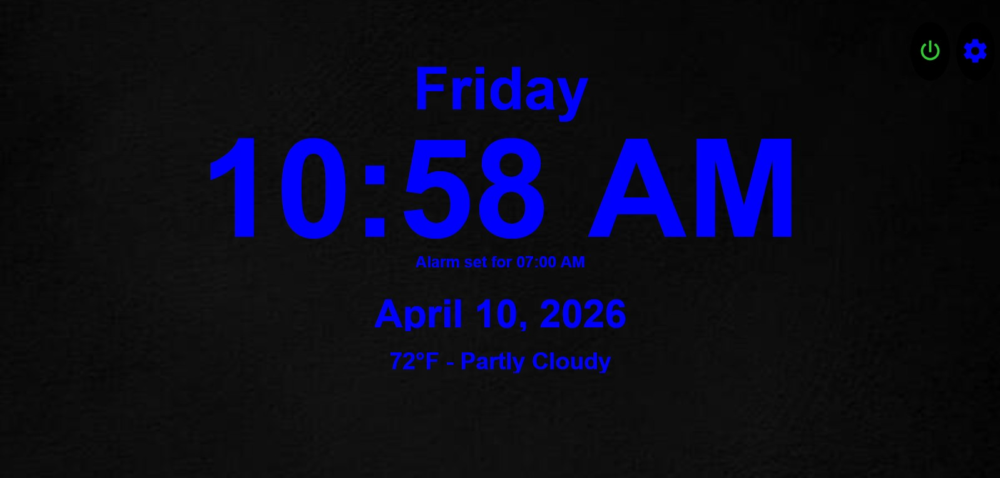
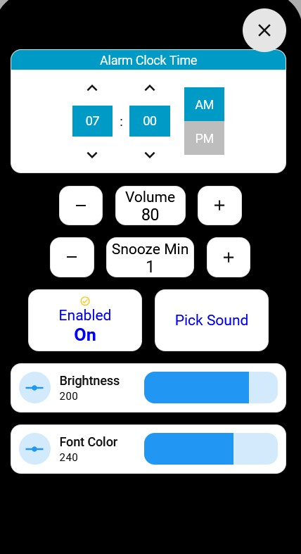
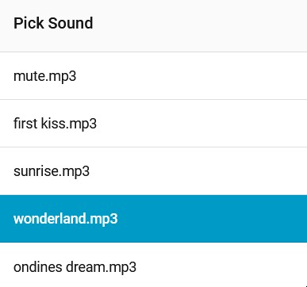

# 🕐 HA Alarm Clock

A fully-featured, tablet-optimized alarm clock for Home Assistant. Designed to run full-screen on a dedicated bedroom tablet — looks great, sounds great, and is completely controlled from within HA.





---

## ✨ Features

- 🕐 **Large digital clock display** with customizable font color (full HSL spectrum)
- 📅 **Day of week + full date** display
- 🌤️ **Live temperature + weather condition** on the clock face
- ⏰ **Set alarm time** via a dedicated time picker
- 🔊 **Fade-in volume** — gradually rises from silent to your chosen level
- 💤 **Snooze** — stops and restarts after a configurable number of minutes
- ✅ **Dismiss** — stops alarm immediately
- 🎵 **Pick your alarm sound** — scans a folder of MP3s; select from a scrollable list
- 🔆 **Auto brightness** — dims the tablet at night, brightens in the morning (weekday/weekend aware)
- 🔴 **Auto-stop** — alarm silences itself after 3 minutes if not dismissed
- ⚙️ **Settings pop-up** — access all controls without leaving the clock view

---

## 📋 Prerequisites

### Hardware
- A tablet running in kiosk mode (e.g. Lenovo Tab, Amazon Fire HD)
- Recommended kiosk app: [Fully Kiosk Browser](https://www.fully-kiosk.com/) — enables brightness control and media playback via HA

### Required HACS Frontend Cards
Install all of these via [HACS](https://hacs.xyz/) → Frontend:

| Card | Purpose |
|------|---------|
| [custom-button-card](https://github.com/custom-cards/button-card) | Main clock display and controls |
| [bubble-card](https://github.com/Clooos/Bubble-Card) | Settings and sound picker pop-ups |
| [mushroom](https://github.com/piitaya/lovelace-mushroom) | Number sliders (brightness, hue) |
| [time-picker-card](https://github.com/GeorgeSG/lovelace-time-picker-card) | Alarm time picker |
| [select-list-card](https://github.com/DoubtfulTurnip/select-list-card/releases/tag/v2.0.3) | Scrollable song list |
| [card-mod](https://github.com/thomasloven/lovelace-card-mod) | Custom card styling |
| [grid-layout](https://github.com/thomasloven/lovelace-layout-card) | Dashboard layout |

### Optional: Digital-7 Font
The clock face uses the `Digital-7` font for an authentic alarm clock look. To install:
1. Download [Digital-7](https://www.dafont.com/digital-7.font) and place it in `/config/www/fonts/`
2. Add to your HA theme or Lovelace resources:
   ```yaml
   extra_module_url:
     - /local/fonts/digital-7.woff2
   ```
If you skip this, the clock will fall back to `sans-serif` — it still works fine.

---

## 🚀 Installation

### Step 1 — Copy alarm sounds
Create the folder `/config/www/alarm_sounds/` and place your `.mp3` files in it.

> You must also include a silent file named `mute.mp3` — this is played first to "wake up" the media player before the real alarm sound. A 1-second silent MP3 works perfectly.

### Step 2 — One-time `configuration.yaml` addition
This is the **only** change needed outside the package file. Add the `allowlist_external_dirs` entry to your existing `homeassistant:` block:

```yaml
homeassistant:
  allowlist_external_dirs:
    - "/config/www/alarm_sounds"   # update path if storing sounds elsewhere
  packages: !include_dir_named packages   # skip if you already use packages
```

Everything else — the folder sensor, template sensors, helpers, scripts, and automations — all live together in the package file. After this one restart, future changes only need a package or template reload.

### Step 3 — Install the package
Copy `package/alarm_clock.yaml` to `/config/packages/alarm_clock.yaml`.

> If you don't have a `packages/` folder yet, create it first, then add `packages: !include_dir_named packages` under `homeassistant:` as shown in Step 2.

### Step 4 — Customize the package
Open `alarm_clock.yaml` and search for `CUSTOMIZE` comments. At minimum, update:

| Item | What to change |
|------|---------------|
| `media_player.bedroom_tablet` | Your tablet's media player entity |
| `number.bedroom_tablet_screen_brightness` | Your tablet's brightness entity (Fully Kiosk) |
| `http://YOUR_HA_IP:8123/...` | Your HA local IP address and port |
| Brightness values (6 / 200) | Night/day brightness levels that work for you |
| Brightness schedule times | 23:00 / 09:00 / 11:00 — adjust to your routine |

### Step 5 — Add the dashboard view
1. Open your HA dashboard → Edit → Raw Configuration Editor
2. Under `views:`, paste the contents of `dashboard/alarm_clock_view.yaml` as a new entry
3. Update the CUSTOMIZE items in the dashboard file:
   - `number.bedroom_tablet_screen_brightness` — your brightness entity
   - `sensor.thermostat_outdoor_temperature` — your outdoor temp sensor
   - `weather.forecast_home` — your weather entity
   - Background image path (or remove the `background:` block entirely)

### Step 6 — Restart Home Assistant
Restart HA once to pick up the `allowlist_external_dirs` change and load the package. After that, navigate to the alarm clock dashboard view on your tablet.

---

## ⚙️ How It Works

```
Alarm Clock Triggered automation
  → watches sensor.time every minute
  → if time matches input_datetime.alarm_clock_time AND alarm is enabled
  → calls script.alarm_clock_start

script.alarm_clock_start
  → sets input_boolean.alarm_clock_ringing = on  (shows Snooze/Dismiss buttons)
  → sets initial volume low
  → plays mute.mp3 (wakes up media player)
  → plays selected alarm sound
  → loop: gradually raises volume every ~1.2 seconds
  → stops loop after 3 minutes OR when ringing boolean turns off
  → calls script.alarm_clock_auto_stop

User taps Snooze
  → script.alarm_clock_snooze: stops audio, turns off ringing, waits N minutes, restarts

User taps Dismiss
  → script.alarm_clock_dismiss: stops audio, turns off ringing
```

---

## 🎨 Customization Tips

**Change the font color:** Use the Font Color slider in Settings — it controls the HSL hue from 0–360. Red=0, Green=120, Blue=240, White requires removing the HSL approach and hardcoding `white`.

**Add more rooms:** The alarm is tied to one media player. To support multiple tablets/rooms, duplicate the scripts and change the `entity_id` targets.

**Loop the alarm sound:** The current setup plays the file once. For looping, you'd need to call `media_player.play_media` in a loop with a condition checking `alarm_clock_ringing`.

**Change the auto-stop timeout:** In `script.alarm_clock_start`, find `> 180` — this is seconds. Change to `> 300` for 5 minutes, etc.

---

## 🗂️ File Structure

```
ha-alarm-clock/
├── README.md
├── package/
│   ├── alarm_clock.yaml                  ← Everything: folder sensor, helpers,
│   │                                       template sensors, scripts, automations
│   └── configuration_yaml_additions.yaml ← One-time allowlist entry for configuration.yaml
├── dashboard/
│   └── alarm_clock_view.yaml             ← Lovelace view YAML
└── docs/
    └── screenshot.png                    ← (add your own screenshot here)
```

---

## 🤝 Contributing

Pull requests welcome! If you add a feature (multi-alarm support, weekday-only mode, etc.) please open a PR.

---

## 📄 License

MIT License — use freely, attribution appreciated.
